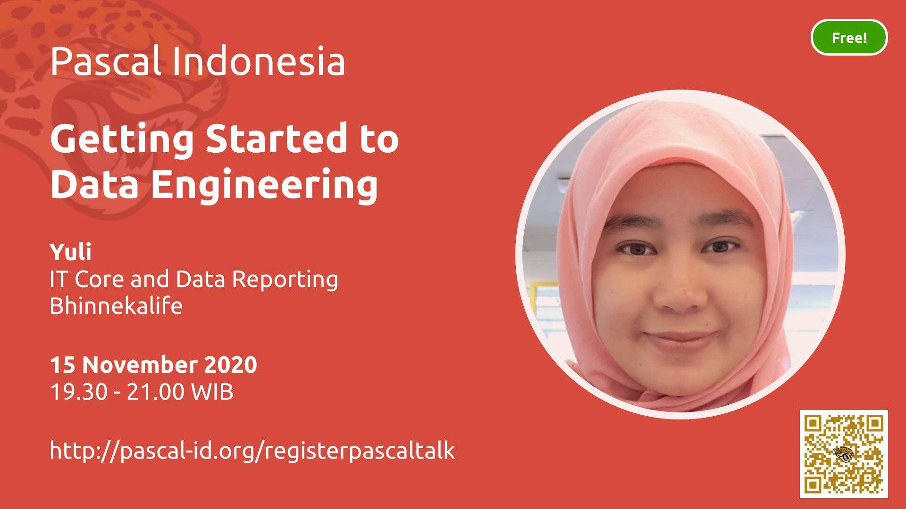

# Pascal Indonesia - Public Data

Pascal Indonesia - Public Data

## Last Event

## Daftar Event 2020

see [events.json](data/events.json)

- [PascalTalk #7: Getting Started to Data Engineering](#pascaltalk-7-getting-started-to-data-engineering)
- [PascalClass #3: Web Development with Free Pascal](#pascalclass-3-web-development-with-free-pascal)
- [PascalClass #2: Machine Learning Recommender & Prediction System](#pascalclass-2-machine-learning-recommender-prediction-system)
- [PascalClass #1: Database Analysis & Design](#pascalclass-1-database-analysis-design)

### PascalTalk #7: Getting Started to Data Engineering

- Tanggal: 2020/11/15
- Pukul: 19:30 - 21:00
- Pembicara: 
  - Yuli, IT Core and Data Reporting, Bhinnekalife
- [Video](https://www.youtube.com/watch?v=5HAlT5-uwvg)

### PascalClass #3: Web Development with Free Pascal

- Tanggal: 2020/11/14
- Pukul: 19:30 - 21:00
- Pembicara: 
  - Luri Darmawan, Founder, Carik.id
- [Video](https://youtu.be/6871Qw7MkMY)

### PascalClass #2: Machine Learning Recommender & Prediction System

- Tanggal: 2020/11/31
- Pukul: 19:30 - 21:00
- Pembicara: 
  - Aria Ghora Prabono, A.I. Enthusiast, PhD candidate at HUFS, Republic of Korea
- [Video](https://www.youtube.com/playlist?list=PL1mjxpqu6OU6B8wtDB26vdNl7nfgjMYGN)

### PascalClass #1: Database Analysis & Design

- Tanggal: 2020/10/26
- Pukul: 19:30 - 21:00
- Pembicara: 
  - Nur Hidayat, IT Enterprise Developer
- [Video](https://www.youtube.com/playlist?list=PL1mjxpqu6OU53zJcwkLWFF03-tNKwhZtq)

## Bantu kami

Bantu kami memperbarui daftar ini 🙏

Pantau grup [Facebook Pascal Indonesia](https://www.facebook.com/groups/pascalid) dan silahkan perbarui data setiap kali ada sesi baru.

Kami sangat berterima kasih untuk setiap bantuan yang teman-teman berikan.

----

©️ 2020 by [Pascal Indonesia](https://pascal-id.org) Team | [Donasi](https://pascal-id.org/donasi)