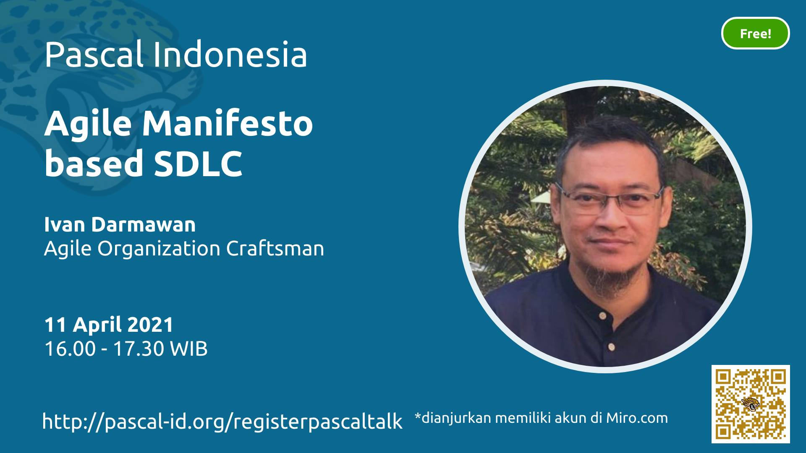

# Pascal Indonesia - Public Data

Pascal Indonesia - Public Data

## Past Event

## Daftar Event 2020

see [events.json](data/events.json)

- [PascalTalk #9: Agile Manifesto based SDLC](#pascaltalk-9-agile-manifesto-based-sdlc)
- [PascalTalk #8: Information Technology Business Agility with SCRUM](#pascaltalk-8-information-technology-business-agility-with-scrum)
- [PascalTalk #7: Getting Started to Data Engineering](#pascaltalk-7-getting-started-to-data-engineering)
- [PascalClass #3: Web Development with Free Pascal](#pascalclass-3-web-development-with-free-pascal)
- [PascalClass #2: Machine Learning Recommender and Prediction System](#pascalclass-2-machine-learning-recommender-and-prediction-system)
- [PascalClass #1: Database Analysis and Design](#pascalclass-1-database-analysis-and-design)
- [Kulgram: Instalasi Lazarus di Perangkat Berbasis ARM](#kulgram-instalasi-lazarus-di-perangkat-berbasis-arm)
- [PascalTalk #6: Kuliah IT di luar negeri, susah gak sih?](#pascaltalk-6-kuliah-it-di-luar-negeri-susah-gak-sih)
- [PascalTalk #5: UX; Research, Design and Engineer](#pascaltalk-5-ux-research-design-and-engineer)
- [PascalTalk #4: Obrolan Ringan Seputar IT](#pascaltalk-4-obrolan-ringan-seputar-it)
- [PascalTalk #3: RADically Fast and Easy Mobile Apps Development](#pascaltalk-3-radically-fast-and-easy-mobile-apps-development)
- [PascalTalk #2: Membuat Sendiri Smart Home](#pascaltalk-2-membuat-sendiri-smart-home)
- [PascalTalk #1: Pemanfaatan Artificial Intelligence di Masa Covid-19](#pascaltalk-1-pemanfaatan-artificial-intelligence-di-masa-covid-19)

### PascalTalk #9: Agile Manifesto based SDLC

- Tanggal: 2021/04/11
- Pukul: 16:00 - 17:30
- Pembicara: 
  - Ivan Darmawan, Agile Organization Craftsman
- [Registration](https://www.pascal-id.org/registerpascaltalk/)

### PascalTalk #8: Information Technology Business Agility with SCRUM

- Tanggal: 2020/12/04
- Pukul: 19:30 - 21:00
- Pembicara: 
  - Dony E (MbahDon), Sarastya Agility Partner
- [Video](https://www.youtube.com/watch?v=Aa2bdxrzneI)

### PascalTalk #7: Getting Started to Data Engineering

- Tanggal: 2020/11/15
- Pukul: 19:30 - 21:00
- Pembicara: 
  - Yuli, IT Core and Data Reporting, Bhinnekalife
- [Video](https://www.youtube.com/watch?v=5HAlT5-uwvg)

### PascalClass #3: Web Development with Free Pascal

- Tanggal: 2020/11/14
- Pukul: 19:30 - 21:00
- Pembicara: 
  - Luri Darmawan, Founder, Carik.id
- [Video](https://www.youtube.com/playlist?list=PL1mjxpqu6OU7HYWd9qK49F-b0yHdxXf0D)

### PascalClass #2: Machine Learning Recommender and Prediction System

- Tanggal: 2020/11/31
- Pukul: 19:30 - 21:00
- Pembicara: 
  - Aria Ghora Prabono, A.I. Enthusiast, PhD candidate at HUFS, Republic of Korea
- [Video](https://www.youtube.com/playlist?list=PL1mjxpqu6OU6B8wtDB26vdNl7nfgjMYGN)

### PascalClass #1: Database Analysis and Design

- Tanggal: 2020/10/26
- Pukul: 19:30 - 21:00
- Pembicara: 
  - Nur Hidayat, IT Enterprise Developer
- [Video](https://www.youtube.com/playlist?list=PL1mjxpqu6OU53zJcwkLWFF03-tNKwhZtq)

### Kulgram: Instalasi Lazarus di Perangkat Berbasis ARM

- Tanggal: 2020/10/21
- Pukul: 19:30 - 21:00
- Pembicara: 
  - Andi Wangsadijaya, SE, IT Developer
- https://t.me/pascalid

### PascalTalk #6: Kuliah IT di luar negeri, susah gak sih?

- Tanggal: 2020/10/10
- Pukul: 19:30 - 21:00
- Pembicara: 
  - Aria Ghora Prabono, A.I. Enthusiast, PhD candidate at HUFS, Republic of Korea
- [Video](https://youtu.be/qOdAoPj_Les)

### PascalTalk #5: UX; Research, Design and Engineer

- Tanggal: 2020/09/26
- Pukul: 19:30 - 21:00
- Pembicara: 
  - Prayudi Utomo, Head of Kolla Education; UX Engineer
- [Video](https://youtu.be/J1SGzTUvcwQ)

### PascalTalk #4: Obrolan Ringan Seputar IT

- Tanggal: 2020/09/12
- Pukul: 19:30 - 21:00
- Pembicara: 
  - Luri Darmawan, Founder Carik Bot Carik.id
  - Cahyo Sasongko, Founder Ajaro.id
  - Tigor M Manurung, IT Developer
  - Nur Hidayat, IT Enterprise Developer
  - Bambang Wahyudi, IT Goverment Developer
- [Video](https://youtu.be/PYJ8VTYJReY)

### PascalTalk #3: RADically Fast and Easy Mobile Apps Development

- Tanggal: 2020/08/22
- Pukul: 19:30 - 21:00
- Pembicara: 
  - Fajar Donny Bachtiar, Mobile Developer
- [Video](https://web.facebook.com/groups/Pascal.ID/permalink/3877752775573143/)

### PascalTalk #2: Membuat Sendiri Smart Home

- Tanggal: 2020/08/08
- Pukul: 19:30 - 21:00
- Pembicara: 
  - Mario Ray Mahardika, Software Engineer, Sirclo
- [Video](https://web.facebook.com/groups/Pascal.ID/permalink/3831538586861229/)

### PascalTalk #1: Pemanfaatan Artificial Intelligence di Masa Covid-19

- Tanggal: 2020/07/25
- Pukul: 19:30 - 21:00
- Pembicara: 
  - Aria Ghora Prabono, A.I Enthusiast
  - Luri Darmawan, Founder Carik Bot @ Carik.id
  - Tigor M Manurung, IT Developer

## Bantu kami

Bantu kami memperbarui daftar ini 🙏

Pantau grup [Facebook Pascal Indonesia](https://www.facebook.com/groups/pascalid) dan silahkan perbarui data setiap kali ada sesi baru.

Kami sangat berterima kasih untuk setiap bantuan yang teman-teman berikan.

----

©️ 2020 by [Pascal Indonesia](https://pascal-id.org) Team | [Donasi](https://pascal-id.org/donasi)